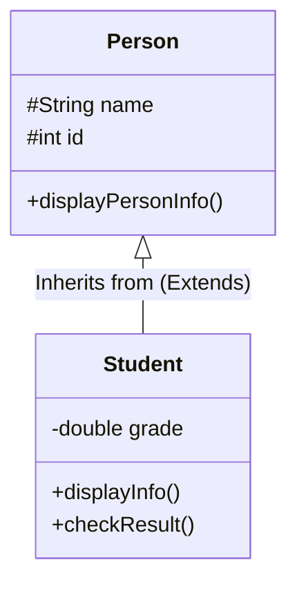

# Student Manager System

This project demonstrates Single Inheritance in Java.

```mermaid
classDiagram
    direction BT
    class Person {
        #String name
        #int id
        +displayPersonInfo()
    }
    class Student {
        -double grade
        +displayInfo()
        +checkResult()
    }
    Student --|> Person : Inherits from (Extends)
```
# Vitalicio_Icamen
